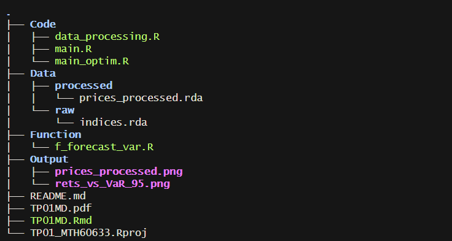

```{r setup, message=FALSE, warning=FALSE}
library(fs)
library(here)
library(zoo)
library(xts)
library(PerformanceAnalytics)
source(here("Code", "data_processing.R"), echo = FALSE)
source(here("Function", "f_forecast_var.R"), echo = FALSE)
source(here("Function", "f_var_roll_wndw.R"), echo = FALSE)
source(here("Code", "main.R"), echo = FALSE)
knitr::read_chunk(here("Function","f_forecast_var.R"))
knitr::read_chunk(here("Function","f_var_roll_wndw.R"))
knitr::read_chunk(here("Code","main.R"))
```

## 1. Structure du projet

Afin d’assurer la reproductibilité et une organisation claire du travail, le projet est structuré en plusieurs dossiers fonctionnels. Le dossier Code contient les scripts exécutables du projet, notamment le traitement des données et le script principal `main` permettant de reproduire l’ensemble des résultats. Le dossier Data regroupe les données utilisées. Il est divisé en deux sous-dossiers : raw pour les données brutes et clean pour les données nettoyées prêtes à être analysées. Le dossier Function contient les fichiers `.R` regroupant les fonctions utilisées dans le projet, comme les fonctions d’estimation GARCH(1,1) et de calcul de la VaR. Enfin, le dossier Output rassemble les résultats générés automatiquement par le code. Cette organisation facilite la reproductibilité, la maintenance et la lisibilité du projet.

### 1.1 Illustration de la structure

```{r, echo=FALSE, out.width="80%", fig.align="center"}

```

### 1.2 Travail collaboratif et gestion de version

Afin de faciliter le travail en équipe et d’assurer le suivi des modifications, le projet est hébergé sur GitHub :

<https://github.com/Ulrizpascuit/TP01_MTH60633.git>

Sur ce répertoire, une branche distincte a été créée pour chaque coéquipier. Cette approche permet de travailler simultanément sans conflits et de récupérer facilement les mises à jour des autres membres.

## 2. Données

### 2.1 Filtrage des données

Premièrement, il a fallu charger le fichier `indices.rda` qui contient un objet, nommé `prices`, de type xts. Cet objet contient les prix journaliers du `SP500` et du `FTSE100` de l'année 1990 à 2013. Le code `data_processing.R` permet de garder seulement les valeurs depuis janvier 2005. Ces valeurs sont sauvegardées dans un autre fichier nommé `prices_processed.rda`. C'est ce fichier qui sera chargé pour le travail. La figure 1 présente les données filtrées qui seront utilisées pour le reste du TP.

```{r echo=FALSE, fig.cap="Valeur des indices (SP500 et FTSE100) depuis janvier 2005",fig.width=6, fig.height=4, out.width="70%", fig.align="center"}
plot.xts(prices_processed, legend.loc="topleft")
```

### 2.2 Calcul des log-rendements

Puisqu'on s'intéresse à faire de la prévision de risque sur les rendements logarithmiques des indices, il faut les calculer. Pour ce faire, la formule qu'on a utilisée est la suivante:

$r_t = \ln\left(\frac{P_t}{P_{t-1}}\right)$

En pratique, on utilise une fonction qui les calcule directement. La figure 2 de la page suivante présente les rendements logarithmiques des deux indices.

```{r echo = FALSE, fig.cap="Valeur des indices (SP500 et FTSE100) depuis janvier 2005",fig.width=6, fig.height=7, out.width="90%", fig.align="center", fig.align="center"}
par(mfrow = c(2, 1), mar = c(4, 4, 3, 1))
plot(index(logRets), logRets[,1],
     type = "l",
     col = "black",
     lwd = 2,
     main = paste("Log-returns —", colnames(logRets)[1]),
     xlab = "Date",
     ylab = "Log-return")
plot(index(logRets), logRets[,2],
     type = "l",
     col = "red",
     lwd = 2,
     main = paste("Log-returns —", colnames(logRets)[2]),
     xlab = "Date",
     ylab = "Log-return")
```

On remarque un comportement typique des rendements logarithmiques des séries financière. Ils sont centrés approximativement en 0 et ont une variance qui semble dépendre du temps. L'intuition de coller un modèle GARCH a ces données est donc acceptable. La suite de ce travail reposera donc sur ces deux séries de données.

## 3. Explications des fonctions

Afin d'arriver à calculer la VaR next-step ahead du modèle GARCH(1,1) collé à nos données, le fichier de fonction nommé `f_forecast_var.R` a été utilisé. Ce fichier contient trois fonctions dont `f_forecast_var` qui calcule directement la VaR à un pas de temps futur. Toutes les fonctions du fichiers ont été corrigées pour assurer leur bon fonctionnement.

### 3.1 Fonction `f_ht`

D'abord, la fonction `f_ht` calcule la variance inconditionnelle du modèle à chaque pas de temps. Cette fonction nécessite en entrée les paramètres du modèle GARCH(1,1) et le vecteur des rendements logarithmiques des indices. La correction de cette fonction a impliqué d'ajouter le calcul de la variance conditionnelle. Au premier pas de temps, la variance conditionnelle est approximée par la variance inconditionnelle du modèle: $$
\sigma^2_1 = \frac{\omega}{1-\alpha-\beta}
$$

Ensuite, la variance conditionnelle est calculée par la formule du modèle GARCH(1,1):

$$
\sigma^2_t = \omega + \alpha y^2_{t-1} + \beta \sigma^2_{t-1}
$$

C'est cette fonction qui nous assure que la variance du prochain choc, donc son impact, dépend du dernier choc observé. Autrement dit, il y a une persistance au niveau des chocs.

Afin de calculer la variance à chaque pas de temps, nous avons exécuté une boucle sur tous les pas de temps. Le code suivant montre la fonction corrigée.

```{r f_ht, echo=TRUE, eval=FALSE}
```

### 3.2 Fonction `f_nll`

Deuxièmement, la fonction `f_nll` est utilisée pour calculer la log-vraisemblance d'un modèle. Cette fonction est très importante, car c'est en minimisant la valeur retournée par celle-ci qu'on obtient des paramêtres optimaux pour le modèle. Ici, on suppose que les données suivent une loi normale centrée en 0 avec une certaine variance. La log-vraisemblance des données est donc calculée en faisant la somme de la densité d'une loi normale centrée en 0 avec une variance pour chaque pas de temps. Cette variance correspond à la variance conditionnelle calculée par la fonction `f_ht`. On a donc $y_t \mid \mathcal{F}_{t-1} \sim \mathcal{N}(0,\sigma_t^2)$ où $\sigma_t^2$ est la variance conditionnelle produite par la fonction `f_ht`. La densité conditionnelle associée est donc :

$$
f(y_t \mid \mathcal{F}_{t-1}) =\frac{1}{\sqrt{2\pi\sigma_t^2}} \exp\left(-\frac{y_t^2}{2\sigma_t^2}\right).
$$ La log-vraisemblance sur $t=1,\dots,T$ s'écrit alors :

$$
\ell(\theta)=\sum_{t=1}^{T}\left[-\frac{1}{2}\log(2\pi)-\frac{1}{2}\log(\sigma_t^2)-\frac{1}{2}\frac{y_t^2}{\sigma_t^2}\right]
$$ Le code suivant montre la fonction corrigée.

```{r f_nll, echo=TRUE, eval=FALSE}
```

### 3.3 Fonction `f_forecast_var`

Troisièmement, la fonction `f_forecast_var` est utilisée afin de calculer la prévision de la Value-at-Risk (VaR) à un pas de temps futur à partir d’un modèle GARCH(1,1) avec erreurs normales. Cette fonction nécessite en entrée le vecteur des rendements logarithmiques des indices ainsi qu’un niveau de risque `level` (par exemple 0.95 pour une VaR au niveau de 95%). La première étape de cette fonction consiste à estimer les paramètres du modèle GARCH(1,1) par maximum de vraisemblance. Pour ce faire, la fonction f_nll définie précédemment est minimisée numériquement. La première correction apportée était de définir les contraintes du problème d’optimisation. Une borne inférieure sur les paramètres doit être définie afin de garantir que ceux-ci demeurent positifs et la condition de stationnarité du modèle GARCH(1,1) doit également être imposée. Ces conditions nous assurent que la variance à chaque temps $t$ est positive. On se retrouve donc avec les contraintes suivantes: $$
\omega > 0, \quad \alpha>0, \quad \beta>0,\quad \alpha + \beta <1
$$ Ces contraintes sont intégrées dans la fonction d’optimisation `constrOptim` (discuté plus loin) sous forme de contraintes linéaires. On doit donc les écrire sous la forme $A\theta \ge b$ où $\theta$ est le vecteur des paramètres ($\omega, \alpha, \beta$). Sous forme matricielle, on a donc: $$
A =
\begin{pmatrix}
1 & 0 & 0 \\
0 & 1 & 0 \\
0 & 0 & 1 \\
0 & -1 & -1
\end{pmatrix},
\quad
\theta =
\begin{pmatrix}
\omega \\
\alpha \\
\beta
\end{pmatrix},
\quad
b =
\begin{pmatrix}
0 \\
0 \\
0 \\
1
\end{pmatrix}
\qquad
\Rightarrow
\qquad
\begin{pmatrix}
1 & 0 & 0 \\
0 & 1 & 0 \\
0 & 0 & 1 \\
0 & -1 & -1
\end{pmatrix}
\begin{pmatrix}
\omega \\
\alpha \\
\beta
\end{pmatrix}
\ge
\begin{pmatrix}
0 \\
0 \\
0 \\
1
\end{pmatrix}
$$ La deuxième correction a été de fournir le code pour l'optimisation du modèle. Ici, la méthode utilisée pour trouver les paramètres optimaux du modèle est de minimiser le négatif du log-vraisemblance. Pour ce faire, nous utilisons la fonction `constrOptim`, pour minimiser la valeur de sortie de la fonction `f_nll` présentée plus tôt. Les contraintes sont directement introduites dans les entrées de l'optimiseur et le vecteur $y$ des rendements logarithmiques est ajouté à la fin des entrées de l'optimiseur afin qu'il puisse être utilisé comme entrée dans l'appel de la fonction `f_nll` (car `f_nll` n'a pas que $\theta$ comme entrée).

La troisième correction a été de calculer la VaR d'un pas de temps futur selon le niveau de tolérance `level`. Étant donnée qu'on suppose que $y_t$ suit une loi normale, alors on on peut obtenir la VaR en calculant le quantile d'une loi normale de variance $\sigma^2_{t+1}$ (variance conditionnelle estimée par le modèle) associée au `level` voulu. 
$$
VaR_{t+1} \;=\; q_{1-\text{level}} \,\sqrt{\sigma_{t+1}^2}
$$ Le code suivant montre la fonction corrigée.

```{r f_forecast_var, echo=TRUE, eval=FALSE}
```

## 4. Estimation statique de la VaR

À partir des fonctions corrigées de la section 3 et en fixant un niveau de risque, il est maintenant possible d'utiliser la fonction `f_forecast_var` pour faire une première estimation statique de la VaR des deux indices. Pour ce faire, on isole une fenêtre d'estimations qui correspond aux 1000 premiers jours de notre échantillon pour chacun des indices. On applique ensuite la fonction `f_forecast_var` pour modéliser leur volatilité respective selon un modèle GARCH(1,1) à un seuil de confiance de 95%. On extrait les résultats à partir de l'objet VaR de la liste de sortie fournie par la fonction, ce qui nous permet d'obtenir l'estimation de la perte journalière maximale anticipée par notre modèle pour chaque indice.

```{r echo=FALSE, warning=FALSE, message=FALSE}
table_var <- data.frame(
  Indice = c("SP500", "FTSE100"),
  VaR_95 = c(var_sp500_val, var_ftse100_val)
)

knitr::kable(table_var,digits = 5,caption = "Estimation statique de la VaR à 95% à l'horizon T+1")
```

Au niveau de risque de 95%, la VaR estimée à l’horizon T+1 est négative puisqu’elle représente une perte (quantile gauche) des rendements. L’indice le plus risqué est celui dont la VaR est la plus faible, donc ayant la VaR la plus négative. On peut voir à partir du tableau 1 que c'est l'indice SP500 qui a la VaR la plus importantes (environ -6.9%) comparativement au FTSE100 (environ -6.2%). Puisqu'on dit qu'un actif avec une plus grande variance est considéré comme plus risqué, alors on peut dire qu'à l'horizon T+1, le SP500 est le plus risqué des deux indices.

## 5. Backtesting

### 5.1 Méthodologie et résultats

Afin d’évaluer la capacité prédictive du modèle GARCH(1,1), une procédure de backtesting est mise en place. L’objectif est de simuler une situation réelle dans laquelle la VaR est estimée uniquement à partir de l’information disponible au moment de la prévision.Pour ce faire, une fenêtre glissante de taille T=1000 observations est utilisée. À chaque itération, le modèle GARCH(1,1) est estimé à partir des 1000 rendements logarithmiques les plus récents disponibles. Par exemple, on utilise les rendements entre la première et millième observation pour estimer la mille et unième VaR; les rendements entre la mille et unième et mille et deuxième pour estimer la mille et troisième VaR et ainsi de suite pour les 1000 prochains jours.
Plus précisément, pour chaque $t = 1001,\dots ,2000$, on considère la fenêtre de données:
$$
y_\text{window} = \{ y_{t-1000},\dots, y_{t-1}\}
$$
On a donc 1000 $y_\text{t-window}$ pour obtenir 1000 ensembles de paramètres optimaux pour ensuite calculer 1000 VaR à des pas de temps consécutifs. De manière plus formelles, on calcule:
$$
VaR_{t} \;=\; q_{0.05} \,\sqrt{\sigma_{t}^2}, \quad \sigma_{t}^2 \; \text{  obtenu du modèle estimé par  } \; y_\text{window} = \{ y_{t-1000},\dots, y_{t-1}\} \; \text{ avec } t = 1001,\dots ,2000
$$
L'implantation de cette méthode de backtesting a été fait à l'aide de deux boucle `for` imbriquées: la première sert a passer tous les indices dont on souhaite calculer les 1000 VaR et la deuxième sert a passer les 1000 VaR à calculer. Une simple adaptation de la variable résultats d'une variable de type `double` à une variable de type `matrix` a été nécessaire comme changement pour s'assurer que les résultats soient bien affichés par la suite. Suite à des tests préliminaires, nous avons remarqué qu'il fallait plus d'une minutes pour calculer toutes les VaR. Afin d'accélérer la reproduction de résultats, l'objet contenant toutes les VaR a été sauvegardé dans un fichier .rda nommé `VaR_roll_xts.rda`. Ainsi, une condition a été ajouté dans le code afin de vérifier si le fichier existait déjà pour ne pas la recalculer à chaque fois. Le code qui suit présente notre manière de vérifier:
```{r verificationFichierVaR, echo=TRUE, eval=FALSE}
```
Ici, on vérifie si le fichier.rda contient un objet dont les noms des colonnes sont les mêmes que les noms des colonnes des données que nous avons chargées. On regarde aussi si la longueur de l'objet est non nulle. Ces conditions ne sont pas très robustes, mais plus que suffisantes dans le cadre de ce travail.

De plus, en raison de l'ajout des conditions présentées précédemment, le code qui calcule toutes les VaR se retrouve dupliqués plusieurs fois. Ainsi nous avons fait une fonction `f_var_roll_wndw` dans le fichier `f_var_roll_wndw.R` qui retourne directement toutes les VaR à calculer. La fonction est la suivante: 

```{r f_var_roll_wndw, echo=TRUE, eval=FALSE}
```
La figure suivante (figure 3) présente les résultats finaux. On y retrouve les rendements logarithmiques des deux indices ainsi que leur VaR respective.
```{r echo = FALSE, fig.cap="Séries de rendements réalisés et estimations de la VaR pour les deux séries",fig.width=8, fig.height=7, out.width="90%", fig.align="center", fig.align="center"}
par(mfrow = c(ncol(logRets), 1), mar = c(4, 4, 3, 6))
for (j in 1:ncol(logRets)) {
  ylim_ <- range(c(logRets_subset[, j], VaR_roll_xts[, j]), na.rm = TRUE)
  plot(index(logRets_subset), as.numeric(logRets_subset[, j]),
       type = "l",
       lwd = 2,                 
       col = "black",
       main = paste0("Rendements réalisés et VaR 95% — ", colnames(logRets)[j]),
       xlab = "Date", ylab = "Rendement / VaR",
       ylim = ylim_)
  lines(index(VaR_roll_xts), as.numeric(VaR_roll_xts[, j]),
        lwd = 3,                  
        col = "red")
  legend("topright",     
         legend = c("Rendements réalisés", "VaR 95% (1-step ahead)"),
         lwd = c(2, 3),
         col = c("black", "red"),
         bty = "n")
}
```
Visuellement, on peut dire que les VaR calculées semblent acceptable et cohérentes avec le mouvement des rendements logarithmiques. En effet, on observe que la VaR varie dans le temps en fonction de la volatilité conditionnelle estimée par le modèle GARCH(1,1). Lorsque les rendements logarithmiques présentent une plus grande variabilité, la variance conditionnelle augmente, ce qui se traduit par une VaR plus négative et donc par une perte potentielle plus importante. À l’inverse, durant les périodes de volatilité plus faible, la VaR se rapproche de zéro.
Cette dynamique reflète la capacité du modèle GARCH(1,1) à capturer les périodes d'augmentation ou de diminution de volatilité ainsi que sa rapidité à s'ajuster lorsqu'un gros choc survient

### 5.2 Vérification et analyse des résultats

Les résultats présentés à la figure 3 semblent bons, mais il n'est pas possible de dire si on trace réellement la VaR à 95%. Une manière rapide et simple de tester cela est de compter le nombre de fois que le rendement logarithmique de chaque indice dépasse la VaR. Puisque le niveau est fixé à 95%, alors on devrait voir 5% du temps des rendements logarithmiques qui dépassent la VaR. Le tableau suivant montre le niveau de risque du modèle ainsi que le niveau de risque implicite, soit celui si on calcule le niveau de risque à partir du modèle collé aux données.
```{r echo=FALSE, warning=FALSE, message=FALSE}
res_phat <- data.frame(
  Serie = c(colnames(logRets)[1], colnames(logRets)[2]),
  p_theorique = c(p, p),
  p_hat = c(phat_sp500, phat_ftse100)
)

knitr::kable(res_phat, digits = 4, caption = "Backtesting VaR 95% : fréquence de violations observée")
```
On voit que l'occurence de dépassement de la VaR est proche de 5%, mais tout de même légèrement au dessus de 5%. Il est possible de dire qu'un échantillon de 1000 données n'est peut être pas assez grand et cela pourrait être la cause de ces deux valeurs supérieures à la valeur théorique. Cependant, d'un point de vue financier, ce résultat est loin d'être étonnant. En effet, on parle souvent que le modèle normal appliqué à des rendements de séries n'est pas adéquat pour bien capter le comportement des valeurs extrêmes. Ici on s'intéresse aux gros rendements négatifs. Le modèle normal va nécessairement sous-estimer la probabilité d'occurence de ce type d'évènement. C'est pourquoi, en pratique, on observe plus de rendements logarithmiques qui dépassent la VaR à 5% qu'en théorie. On pourrait aussi discuter de l'asymétrie (skewness) des données qui pourrait aussi avoir un impact sur cette différence avec la donnée théorique de 5%, car le modèle normal est symétrique. Cela étant dit, on voit que le GARCH(1,1) donne une bonne allure générale de la VaR estimée à un pas futur, mais c'est loin d'être le modèle le plus adéquat à utiliser.


